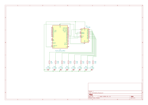

# Weightloss-Tracker

Arduino project for tracking weight loss progress with LEDs

## Weight Tracker Controller (weight-tracker.ino)

Logic for arduino to recieve weight values over bluetooth.

## Web Application (web-app.html)

Web application for connecting to the arduino (via bluetooth), entering weight values, and sending the values to the arduino.p

## Led Controller (led-controller.ino)

Contains logic for controlling the onboard LED on the arduino. This is used to test the bluetooth connection to the arduino.

## Web Controller (web-controller.html)

Web app that handles sending values to the arduino over bluetooth.

## Bill of Materials and Schematic

This project uses:

### BOM

| Part               | Count |
| ------------------ | ----- |
| Arduino Nano ESP32 | 1     |
| SN74HC595N         | 1     |
| 5mm LED - Red      | 5     |
| 5mm LED - Yellow   | 2     |
| 5mm LED - Green    | 2     |
| 220-ohm Resistor   | 8     |

### Schematic

